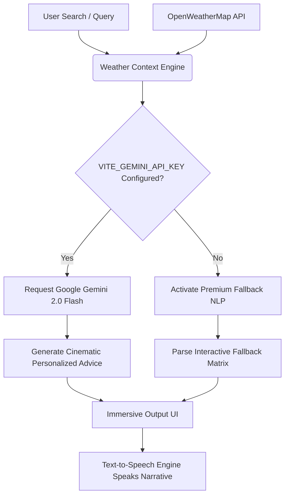

# 🌤️ Weather Forecast Pro — Cinematic AI Weather Intelligence

<div align="center">


[](https://vite.dev/)
[](https://react.dev/)
[](https://tailwindcss.com/)
[](https://www.typescript.org/)
[](https://deepmind.google/technologies/gemini/)
[](LICENSE)
[](https://vercel.com/)

**Experience weather forecasting elevated to an interactive art form.** Weather Forecast Pro fuses real-time global sat-link forecasts with Gemini-powered generative weather narratives, smart environmental wellness diagnostics, and voice-guided controls, all wrapped in a high-refraction glassmorphic cinematic user interface.

[Explore Live Demo](https://weather-forecast-pro-six.vercel.app/) · [Report Bug](https://github.com/javawithaaryan/Weather-Forecast-Pro/issues) · [Request Feature](https://github.com/javawithaaryan/Weather-Forecast-Pro/issues)

</div>

---

## 📖 Table of Contents
1. [Project Overview](#-project-overview)
2. [Futuristic Project Description](#-futuristic-project-description)
3. [Core & Advanced Features](#-core--advanced-features)
4. [Weather X AI System](#-weather-x-ai-system)
5. [Health & Weather Intelligence](#-health--weather-intelligence)
6. [Natural Voice Assistant](#-natural-voice-assistant)
7. [Weather-Reactive Particle System](#-weather-reactive-particle-system)
8. [Tech Stack](#%EF%B8%8F-tech-stack)
9. [Installation & Local Setup](#-installation--local-setup)
10. [Optimized Directory Structure](#-optimized-directory-structure)
11. [Screenshots & Visual Previews](#-screenshots--visual-previews)
12. [Production Deployment Guide](#-production-deployment-guide)
13. [Future Expansion Scope](#-future-expansion-scope)
14. [Author & Contributions](#-author--contributions)

---

## 🌟 Project Overview

**Weather Forecast Pro** is a cinematic, state-of-the-art climate intelligence platform. Built with **React 18**, **Vite 6**, and **TypeScript**, it is powered by tailwindcss v4 and modern motion graphics. The platform completely bypasses flat, uninspired grid layouts in favor of an immersive dashboard that responds organically to the weather itself. 

By integrating the **OpenWeatherMap API** with **Google Gemini 2.0 AI**, Weather Forecast Pro transforms dry statistics (like barometric pressure, wind headings, and humidity decimals) into clear, conversational, actionable lifestyle advice. 

---

## 🌌 Futuristic Project Description

Imagine stepping onto the bridge of an atmospheric command center. 

Weather Forecast Pro delivers this precise aesthetic. It treats climate telemetry not as static columns of numbers, but as an interactive dashboard. As you search any city worldwide:
* **The background morphs:** Canvas-driven golden sun-rays sweep across your monitor on clear afternoons; misty fog blankets your screen at night; high-speed raindrops slice downward during storms; and light snowflakes drift gently on winter mornings.
* **Refractive panels float:** Custom glassmorphic cards refract the background canvas dynamically using high-performance hardware-accelerated `-webkit-backdrop-filter` and advanced CSS grids.
* **Tactical widgets pulse:** Smart alert cards highlight coastal flash fog or severe squalls, while interactive Leaflet radar globes trace wind vectors and cloud density in real-time.

This is not a utility app — it is a cinematic, high-fidelity experience designed to make weather forecasting beautiful and interactive.

---

## ⚡ Core & Advanced Features

### 1. Unified Telemetry Interface
* **Auto-location Detection**: Detects your location via the browser Geolocation API with graceful fallback to Delhi if blocked.
* **Instant Unit Conversion**: Switch dynamically between metric and imperial scales, with all charts, summaries, and metrics updating instantly.
* **Tactical Solar Readings**: Sunrise/Sunset schedules calculated with precise local offset timers.
* **Dual Trend Visualization**: Hourly trends and daily High-Low forecasts visualized using beautifully animated SVG curves and ChartJS layouts.

### 2. High-Refraction Glassmorphic Design
* **Adaptive Mesh Glows**: High-performance multi-colored gradient blobs float in the background, rotating and scaling based on current conditions.
* **Tactical Feed Indicator**: A pulsing, neon-cyan live sat-link simulation indicator provides the high-energy feedback of active satellites.
* **Interactive Hover Shimmers**: Cards reflect a bright, sleek light shimmer when swept over by a cursor, guided by custom cubic-bezier transitions.

### 3. Progressive Web App Core
* **Offline Caching**: Built-in configuration options allowing instant offline viewing of cached weather.
* **Local Storage Storage**: Saves your home city and favorite locations automatically so they load immediately upon launch.

---

## 🤖 Weather X AI System

At the heart of the platform sits **Weather X AI** — a premium futuristic weather concierge. 



### 🧠 Gemini Generative Integration
* Utilizes **Gemini 2.0 Flash** via a custom API connector inside [geminiService.ts](file:///d:/Weather%20Forecast%20Pro/src/services/geminiService.ts).
* Merges real-time weather metrics (temp, feels-like, wind headings, UV indices, air contaminants) with a highly specialized prompt matrix.
* Delivers conversational summaries, travel safety recommendations, outdoor viability reviews, and outfit advice.

### 🛡️ Premium Intelligent Fallback
* If no Gemini key is provided, the platform automatically switches to a complex local NLP generation engine. It processes 12 different weather states, dry/damp environments, cold transitions, and high-velocity wind headings to output realistic human-sounding advice.
* Handles target cities like **Goa** or **Shimla** with specialized micro-narratives tailored to high-altitude or coastal resort microclimates!

---

## 🩺 Health & Weather Intelligence

Weather Forecast Pro incorporates an advanced **Environmental Wellness Dashboard** inside [HealthIntelligence.tsx](file:///d:/Weather%20Forecast%20Pro/src/health/HealthIntelligence.tsx).

It calculates an organic **Environmental Wellness Score** from 0 to 100 based on:
1. **Air Contaminants**: Evaluates AQI levels, PM2.5 concentrations, and Ozone levels.
2. **Thermal Stress**: Evaluates extreme temperature boundaries and "feels-like" temperature differentials.
3. **Moisture & Wind**: Factoring in humidity and high wind fatigue factors.

### Real-Time Advisories Provided:
* 🏃‍♂️ **Outdoor Activity Viability**: Detailed evaluations on athletic training limits, running viability, and fatigue points.
* 🫁 **Respiratory Defense**: Specific alerts on asthma triggers and dust thresholds when PM2.5 levels rise.
* 🧴 **Dermal Shielding**: Smart recommendations on UV sunscreen factors (SPF 30 vs 50) and moisturization requirements based on relative dry indexes.

---

## 🎙️ Natural Voice Assistant

No futuristic deck is complete without speech interaction. Weather Forecast Pro features a custom-engineered **Voice Assistant** hook [useVoiceAssistant.ts](file:///d:/Weather%20Forecast%20Pro/src/hooks/useVoiceAssistant.ts).

### Features:
* **One-Touch Hands-Free Control**: Connects directly to the **Web Speech API** for rapid Speech Recognition.
* **Intelligent Speech Synthesis**: Automatically converts generated markdown outputs into natural, clear speech.
* **Voice-Filter Matrix**: Filters out asterisks, hash characters, and backticks to deliver pure, fluid speech.
* **Preferred Voice Selection**: Scans the client system voices to bind to high-quality female English voices (Samantha, Zira, Hazel, Heather, Karen) for a sleek, responsive tone.
* **Cinematic Pulse State**: The Weather X AI avatar scales, glows, and rotates in sync with vocal input states (Listening, Thinking, Speaking).

---

## 🌌 Weather-Reactive Particle System

Animations in Weather Forecast Pro run on a hardware-accelerated **HTML5 Canvas particle loop** within [WeatherReactiveBackground.tsx](file:///d:/Weather%20Forecast%20Pro/src/animations/WeatherReactiveBackground.tsx). 

| Weather Condition | Canvas Particle Style | Ambient Glow Colors | Special Overlay FX |
| :--- | :--- | :--- | :--- |
| **Clear Day** | Golden & cyan dust drifting slowly upward | `#ff8a00` to `#FFB800` | Conic-gradient sweeping sun-rays |
| **Clear Night** | Sparkling blue celestial dust | `#1e1b4b` to `#4f00d0` | Starry night coordinates |
| **Cloudy** | Dense slate particles floating slowly | `#6366f1` to `#494455` | Overcast ambient dim |
| **Rainy** | Fast-dropping vertical rain vectors | `#004d66` to `#001B4B` | Falling rain streaks |
| **Thunderstorm** | Rapid blue-cyan raindrops | `#1a0a2e` to `#4f00d0` | Random high-contrast light flashes |
| **Snowy** | Swirling fluffy white circles rotating 360° | `#70d2ff` to `#cac3d8` | Falling drifting snow flakes |
| **Foggy** | Heavy gray dust hovering in static states | `#494455` to `#333535` | Mouse-interactive radial fog |

---

## 🛠️ Tech Stack

* **Client Core Framework**: React 18.3.1 (TypeScript v5)
* **Build System & Tooling**: Vite 6.3.5 (configured for ultra-fast Hot Module Replacement)
* **Styling & Layout System**: Tailwind CSS v4.1.12 (`@import 'tailwindcss'` source system)
* **Interactive Dynamic Maps**: React Leaflet 4.2.1 & Leaflet 1.9.4
* **Motion Graphics & Physics**: GSAP 3.15 & Motion (React)
* **Charts & Telemetry Curves**: Recharts 2.15.2 & Chart.js 4.4.9
* **Developer Icons**: Lucide React & Google Material Icons

---

## ⚙️ Installation & Local Setup

Get your own weather intelligence platform running locally in under 3 minutes:

### 1. Clone the Repository
```bash
git clone https://github.com/javawithaaryan/Weather-Forecast-Pro.git
cd Weather-Forecast-Pro
```

### 2. Install Project Dependencies
We recommend using `npm` or `pnpm` to resolve lock files cleanly:
```bash
npm install
```

### 3. Configure Your Environment Variables
Create a `.env` file in the root directory:
```env
# OpenWeatherMap API Key (A default fallback key is included inside weatherService.ts)
VITE_OPENWEATHER_API_KEY=your_openweather_api_key_here

# Google Gemini API Key (Required for the Weather X AI Assistant)
VITE_GEMINI_API_KEY=your_gemini_api_key_here
```

### 4. Fire Up the Development Server
```bash
npm run dev
```
Open [http://localhost:5173](http://localhost:5173) in your browser.

### 5. Compiling a Production Build
Verify bundle sizes and build files cleanly:
```bash
npm run build
```

---

## 📂 Optimized Directory Structure

The project has been cleaned, refactored, and organized to enforce absolute separation of concerns:

```
Weather-Forecast-Pro/
├── dist/                          # Compiled production bundles
├── public/                        # Static metadata assets
│   └── manifest.json              # PWA manifest configurations
├── src/
│   ├── ai/
│   │   └── WeatherXAI.tsx         # Weather X AI chat panel component
│   ├── animations/
│   │   ├── effects.css            # Canvas-particle weather style physics
│   │   └── WeatherReactiveBackground.tsx # Primary canvas animation orchestrator
│   ├── app/
│   │   ├── components/            # Primary Dashboard component modules
│   │   │   ├── ui/                # UI design system components
│   │   │   ├── AirQuality.tsx     # AQI telemetry widget
│   │   │   ├── BottomNavigation.tsx # Viewport quick-links bar
│   │   │   ├── CurrentWeather.tsx  # Hero temperature display
│   │   │   ├── Header.tsx         # Brand header with GPS toggle
│   │   │   ├── HourlyForecast.tsx # Tactical timeline display
│   │   │   ├── SearchCommandCenter.tsx # Relocated unified location command bar
│   │   │   └── SevenDayForecast.tsx # Orbital 7-day projection widget
│   │   └── App.tsx                # Core Application layout orchestrator
│   ├── charts/
│   │   └── WeatherCharts.tsx      # SVG trend curves and telemetry charts
│   ├── context/
│   │   └── WeatherContext.tsx     # Unified state & caching context
│   ├── health/
│   │   └── HealthIntelligence.tsx # Wellness and respiratory advisors panel
│   ├── hooks/
│   │   └── useVoiceAssistant.ts   # Web Speech API recognition & speech hook
│   ├── maps/
│   │   └── WeatherMap.tsx         # Interactive Leaflet dark radar map
│   ├── services/
│   │   ├── geminiService.ts       # Gemini API query controller & fallback NLP
│   │   ├── healthIntelligence.ts  # Health score & advice generation engine
│   │   └── weatherService.ts      # Axios OpenWeatherMap fetch & mapping adapter
│   ├── styles/
│   │   ├── fonts.css              # Custom font weights & Material Symbols
│   │   ├── index.css              # Unified global style entry point
│   │   ├── tailwind.css           # Tailwind v4 import configs
│   │   └── theme.css              # CSS variables & glassmorphism configurations
│   ├── utils/
│   │   └── weatherHelpers.ts      # Conversions, date parsing, icon mapping
│   ├── voice/
│   │   └── VoiceWaveform.tsx      # Sound waves indicator for Voice Assistant
│   ├── weather/
│   │   └── types.ts               # Core TypeScript interface declarations
│   ├── main.tsx                   # React DOM compiler mount point
│   └── vite-env.d.ts              # Vite TS definitions
├── .env.example                   # Env reference file
├── .gitignore                     # Git tracking exclusions
├── index.html                     # Core HTML mount page
├── package.json                   # Project scripts and dependencies
├── postcss.config.mjs             # PostCSS configurations
├── vercel.json                    # Single-Page App redirect routing configuration
└── vite.config.ts                 # Custom Vite resolver & plugin setups
```

---

## 🚢 Production Deployment Guide

Weather Forecast Pro includes routing redirects optimized for Single-Page Applications deployed on modern platforms.

### Deploy to Vercel
This project is configured out-of-the-box for **Vercel** via [vercel.json](file:///d:/Weather%20Forecast%20Pro/vercel.json):
1. **Push your code** to GitHub.
2. Go to [Vercel Dashboard](https://vercel.com/) and click **Add New Project**.
3. Import this repository.
4. Add your **Environment Variables** in the Vercel Setup Wizard:
   * `VITE_OPENWEATHER_API_KEY`
   * `VITE_GEMINI_API_KEY`
5. Click **Deploy**. Vercel will automatically build the project using Vite and deploy it to a high-speed CDN.

---

## 🔮 Future Expansion Scope

The platform is designed to scale with these architectural additions:
* [ ] **ESP32 Sensor Array Direct Link**: Integrate real-time micro-climate metrics via domestic IoT sensors over WebSockets.
* [ ] **Cinematic Precipitation Audio**: Spatial atmospheric background sound loops (raindrops, wind chimes, distant thunder) synced directly to weather conditions.
* [ ] **Interactive 3D Earth Globe**: A WebGL/ThreeJS interactive planet model to trace worldwide global jet streams.
* [ ] **Multi-location Dynamic Compare Grid**: Cross-compare climate matrices of up to 4 global cities side-by-side.

---

## 👨‍💻 Author & Contributions

**Developed with ❤️ by Aryan Rathore**
* Github: [@javawithaaryan](https://github.com/javawithaaryan)
* Project Repo: [Weather Forecast Pro](https://github.com/javawithaaryan/Weather-Forecast-Pro)

This project has been thoroughly refactored, performance-optimized, and built to stand out as a top-tier hackathon-level portfolio piece. Contributions, issue reports, and stars are always welcome!

---

*Powered by OpenWeatherMap API & Google Gemini 2.0 AI · Cinematic Intelligence Platform*
